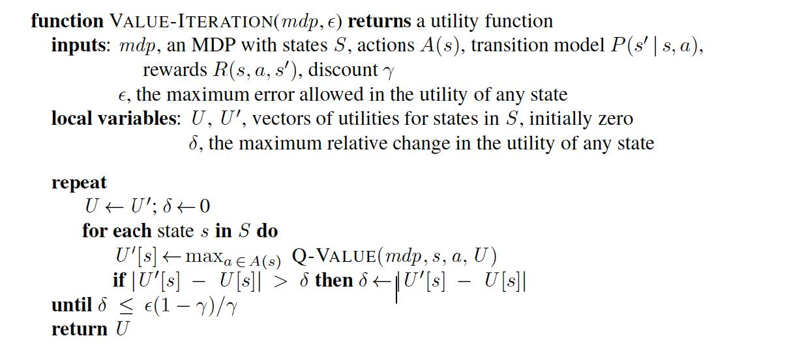

# FrozenLake_ValueIteration

Simple implementation of value iteration coded from scratch to solve frozen lake problem. This algorithm was originally built for elevator domain which able to achieve target reward <-300.

<p align="center"></p>

# Environment

The game starts with the player at location [0,0] of the frozen lake grid world with the goal located at far extent of the world e.g. [3,3] for the 4x4 environment.

Holes in the ice are distributed in set locations when using a pre-determined map or in random locations when a random map is generated.

The player makes moves until they reach the goal or fall in a hole.

The lake is slippery (unless disabled) so the player may move perpendicular to the intended direction sometimes (see is_slippery).

Randomly generated worlds will always have a path to the goal.

Elf and stool from https://franuka.itch.io/rpg-snow-tileset. All other assets by Mel Tillery http://www.cyaneus.com/.

## Action Space
The action shape is (1,) in the range {0, 3} indicating which direction to move the player.

0: Move left

1: Move down

2: Move right

3: Move up

## Observation Space
The observation is a value representing the player’s current position as current_row * nrows + current_col (where both the row and col start at 0).

For example, the goal position in the 4x4 map can be calculated as follows: 3 * 4 + 3 = 15. The number of possible observations is dependent on the size of the map.

The observation is returned as an int().

## Starting State
The episode starts with the player in state [0] (location [0, 0]).

## Rewards
Reward schedule:

Reach goal: +1

Reach hole: 0

Reach frozen: 0

## Episode End
The episode ends if the following happens:

## Termination:

The player moves into a hole.

The player reaches the goal at max(nrow) * max(ncol) - 1 (location [max(nrow)-1, max(ncol)-1]).

Truncation (when using the time_limit wrapper):

The length of the episode is 100 for 4x4 environment, 200 for FrozenLake8x8-v1 environment.


# Results Demo

With only 14 steps, the player reaches the goal.

<video width="320" height="240" controls>
  <source src="src/agent/temp_vis/value_iteration.mp4" type="video/mp4">
</video>


# To setup the environment:

```bash
pip install virtualenv
conda create -n elevator_py38 --python=3.8
conda activate elevator_py38
pip install -r requirement.txt
